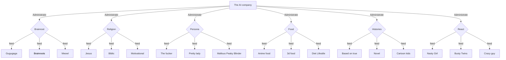

```mermaid
flowchart TD
    A[The AI company] -->|Administrate| C{Brainroot}
    C -->|feed| D[Gugugaga]
    C -->|feed| E[<a href='http://google.com' style="text-decoration: none; color: black" target="_blank">Brainroots</a>]
    C -->|feed| F[Meowl]
    A -->|Administrate| G{Religion}
    G -->|feed| H[Jesus]
    G -->|feed| I[Biblic]
    G -->|feed| J[Motivational]
    A -->|Administrate| K{Persona}
    K -->|feed| L[The fucker]
    K -->|feed| M[Pretty lady]
    K -->|feed| N[Mafious Peaky Blinder]
    A -->|Administrate| O{Food}
    O -->|feed| P[Anime food]
    O -->|feed| Q[3d food]
    O -->|feed| R[Diet Lifestile]
    A -->|Administrate| S{Histories}
    S -->|feed| U[Based on true]
    S -->|feed| V[Novel]
    S -->|feed| W[Cartoon kids]
    A -->|Administrate| X{React}
    X -->|feed| X1[Nasty Girl]
    X -->|feed| X2[Busty Twins]
    X -->|feed| X3[Crazy guy]
```
  
